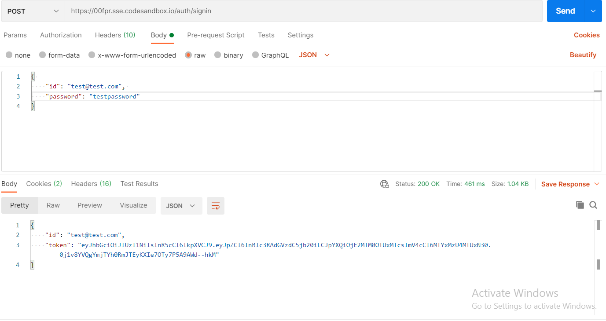

## Sandbox URL

```
https://00fpr.sse.codesandbox.io/
```

## To start node server

```
npm run dev
```

---

## Signin (hardcoded id and password for testing)

### POST /auth/signin

- return and set jwt token in cookies if sign in is successful

```
Input JSON

{
  "id": "test@test.com",
  "password": "testpassword"
}
```

```
Expected Output

{
  "id": "test@test.com",
  "token": "eyJhbGciOiJIUzI1NiIsInR5cCI6IkpXVCJ9.eyJpZC8....."
}
```



---

## Intersection API

### POST /intersections

- return point of intersection(s) for a given line string and the line strings stored in database.
- should be signed in

```
Input JSON

{
  "type": "LineString",
  "coordinates": [
    [-96.79512, 32.77823],
    [-96.79469, 32.77832],
    [-96.79433, 32.77728],
    [-96.79424, 32.77715]...
  ]
}
```

```
Expected Output

[
  {
    "id": 1,
    "poi": {
      "type": "FeatureCollection",
      "features": [
        {
          "type": "Feature",
          "properties": {},
          "geometry": {
            "type": "Point",
            "coordinates": [
              -96.79469,
              32.77832
            ]
          }
        }
      ]
    }
  }
]
```


---

## logs


